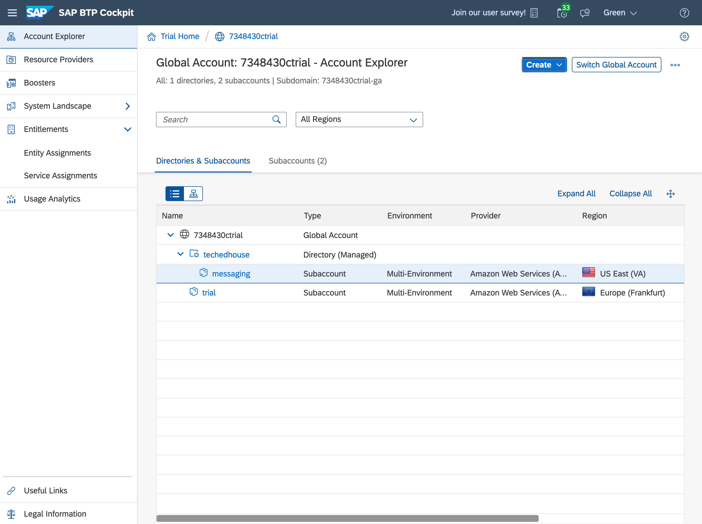
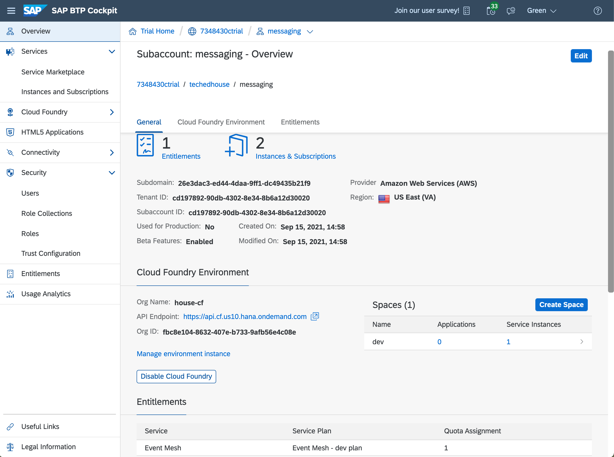

# The power and flexibility of CLI tools

> Open on Houseguest full screen in the Diary Room

My housemates, for the most part, are using all these fancy graphical user interfaces in their daily work. What they don't realise is that this is slowing them down, and they could work at the speed of thought by using command line tools to get things done. What's more, they keep you focused, can be combined, and most powerfully, can be scripted. With tools for the command line interface - the CLI - from SAP, I get to operate in the most powerful and flexible environment - the shell.

## Context

For the TechEd House project, I have to set up an Event Mesh based messaging service in a separate, self-contained subaccount on the SAP Business Technology Platform. With the btp CLI combined with the Cloud Foundry CLI, this is super easy, and ready for automation too if I needed it. Let's get to it.

> Transition to demo in the main screen and Diary Room with Houseguest in small window in corner. On screen is a terminal window with the output of `btp` showing, with me logged in, but only the global account targeted, like this:

```
; btp
SAP BTP command line interface (client v2.8.0)

Usage: btp [OPTIONS] ACTION [GROUP/OBJECT] [PARAMS]

CLI server URL:                    https://cpcli.cf.eu10.hana.ondemand.com (server v2.8.0)
User:                              P2003480923 (qmacro+green@gmail.com)
Configuration:                     /home/user/.config/btp/config.json
Autocomplete script (bash):        /home/user/.config/btp/autocomplete/scripts/sapbtpcli-autocomplete.plugin.sh
RCFile path (bash):                /home/user/.bashrc

Current target:
  Global account (subdomain: 7348430ctrial-ga)

Tips:
  For information about the targeting mechanism, use 'btp --help target'.
  To display general help, use 'btp --help'.

OK
```

## Checking the existing hierarchy

I'm logged into my btp global account, so I take a quick look at the hierarchy I have right now:

```
; btp get accounts/global-account --show-hierarchy
Showing details for global account 59b766f4-8c29-403e-a6ce-7b7d6a7ecaab...

├─ 7348430ctrial (59b766f4-8c29-403e-a6ce-7b7d6a7ecaab - global account)
│  ├─ trial (937f3cd4-5d33-461a-bece-89b943d19c50 - subaccount)

type:            id:                                    display name:   parent id:
global account   59b766f4-8c29-403e-a6ce-7b7d6a7ecaab   7348430ctrial
subaccount       937f3cd4-5d33-461a-bece-89b943d19c50   trial           59b766f4-8c29-403e-a6ce
;
```

> I'm using my [truncated flavour](https://qmacro.org/autodidactics/2021/09/15/using-functions-more/) of `btp` here.

## Checking the existing entitlement

Before I go any further, I check to make sure I have an entitlement for the messaging service. Let's see what I have at the global account level:

```
; btp list accounts/entitlement

Showing entitlements for subaccount 937f3cd4-5d33-461a-bece-89b943d19c50:

service name                                        service plan              quota
ppservice-inbound-trial                             trial                     1
ppservice-odata-trial                               default                   1
business-rules                                      lite                      1
transport                                           standard                  1
...
```

> Show entire list, which is long.

Wow, that's a lot of good stuff. Let me narrow down the search:

```
; btp list accounts/entitlement | grep messaging
enterprise-messaging                                dev                       1
enterprise-messaging-hub                            standard                  1
```

There it is, `enterprise-messaging` with the `dev` plan, lovely.

I'm going to want to use that entitlement in another separate subaccount that I'm about to create, within a directory, so I'll just remove it from this trial subaccount so I have it ready to reassign in a minute. I'll do this by setting the quota amount to zero.

I'll need to specify the GUID of the trial subaccount, which I can get with a little script. Already you can see I'm able to level up my skills and efficiency by getting this CLI to work _with_ me, not against me, making me more efficient. And the btp CLI, like other SAP command line tools, lends itself nicely to that purpose.

Here's the GUID for the trial subaccount:

```
; bgu trial
937f3cd4-5d33-461a-bece-89b943d19c50
```

## Reducing existing entitlement quota to zero

Right, let's specify that in the assignment to zero:

```
; btp assign accounts/entitlement --for-service enterprise-messaging --plan dev --to-subaccount $(bgu trial) --amount 0

Assigning global account entitlement to subaccount...

global account id:   59b766f4-8c29-403e-a6ce-7b7d6a7ecaab
subaccount id:       937f3cd4-5d33-461a-bece-89b943d19c50
service/app name:    enterprise-messaging
service plan name:   dev
quota:               0
enable:              false

Command runs in the background.
Use 'btp list accounts/entitlement' to verify status.


OK
```

## Creating the directory

OK! Now I'm ready to create the new TechEd House project subaccount, in a directory, and use Event Mesh there.

Let's see, how can I do this, let me try with `btp create` and see if it can give me some assistance:

> Types in `btp cr<tab>` to start the autocomplete, which first completes to `btp create`:

```
; btp create
```

> Then hits `<tab>` again to autocomplete to the group/objects that can be created:

```
; btp create
accounts/directory             accounts/subaccount            services/binding
accounts/environment-instance  security/role                  services/instance
accounts/resource-provider     security/role-collection
```

That's some pretty powerful autocompletion going on right there. And I can see `accounts/directory`, let's ask for help on that:

> Uses `<tab>` based autocompletion again (`a<tab> d<tab`) to complete to `accounts/directory` and adds `--help`, resulting in a whole load of information:

```
; btp create accounts/directory --help
Usage: btp [OPTIONS] create accounts/directory --global-account SUBDOMAIN [--features LIST] --display-name NAME [--description DESCRIPTION] [--parent-directory ID] [--directory-admins JSON] [--subdomain SUBDOMAIN] [--custom-properties JSON]

Directories allow you to organize and manage your subaccounts according to your technical and business needs. The use of directories is optional.

You can create up to 5 levels of directories in your account hierarchy. If you have directories, you can still create subaccounts directly under your global account.

Directory features: Set the '--features' parameter to specify which features to enable for the directory. Use either the feature name or its character.
...
```


Wow, that's great. Seems pretty straightforward, all I need is to specify a name and the features that allow me to manage things there:

```
; btp create accounts/directory --display-name techedhouse --features D,E,A

Creating directory in global account 59b766f4-8c29-403e-a6ce-7b7d6a7ecaab...

directory id:         05a5f420-5a83-432d-9572-da61f97c6935
display name:         techedhouse
description:
subdomain:            05a5f420-5a83-432d-9572-da61f97c6935
directory features:   DEFAULT,ENTITLEMENTS,AUTHORIZATIONS
created by:           qmacro+green@gmail.com
parent id:            59b766f4-8c29-403e-a6ce-7b7d6a7ecaab
parent type:          global account
state:                Started

Command runs in the background.
Use 'btp get accounts/directory' to verify status.

OK
```

## Checking the new directory in the hierarchy

Great. I can see that new directory in the hierarchy too.

> Uses command history search to recall and reinvoke the command:

```
; btp get accounts/global-account --show-hierarchy
Showing details for global account 59b766f4-8c29-403e-a6ce-7b7d6a7ecaab...

├─ 7348430ctrial (59b766f4-8c29-403e-a6ce-7b7d6a7ecaab - global account)
│  ├─ trial (937f3cd4-5d33-461a-bece-89b943d19c50 - subaccount)
│  ├─ techedhouse (21928858-2106-4faf-b220-575d5cd77e3f - directory)

type:            id:                                    display name:   parent id:
global account   59b766f4-8c29-403e-a6ce-7b7d6a7ecaab   7348430ctrial
subaccount       937f3cd4-5d33-461a-bece-89b943d19c50   trial           59b766f4-8c29-403e-a6ce
directory        21928858-2106-4faf-b220-575d5cd77e3f   techedhouse     59b766f4-8c29-403e-a6ce
```

## Assigning service quota to directory

Now I can assign that service quota to this new directory, so it's ready for consumption from within the subaccount I'm going to create within it. The command is almost the same, so I'll recall the previous one and just modify it a bit:

> Uses command history search to find the previous `btp assign` command, and then edits it to assign a quota of 1 to the directory:

```
; btp assign accounts/entitlement --for-service enterprise-messaging --plan dev --to-directory $(bgu techedhouse) --amount 1 --auto-assign

Assigning global account entitlement to directory...

global account id:        59b766f4-8c29-403e-a6ce-7b7d6a7ecaab
directory id:             05a5f420-5a83-432d-9572-da61f97c6935
service/app name:         enterprise-messaging
plan name:                dev
amount:                   1
distribute:               false
auto assign:              true
auto distribute amount:
enable:                   false

Command runs in the background.
Use 'btp list accounts/entitlement' to verify status.


OK
```

Checking for the service entitlement, I can see it's assigned to our TechEd House directory, with quota available:

```
; btp list accounts/entitlement | grep techedhouse

OK
enterprise-messaging                                dev                       1.0     techedhouse   05a5f420-5a83-432d
;
```

Great!

## Creating the new subaccount

Now that I have somewhere to put this separate subaccount, I can create it. But I want to check _where_ I can create it first - I'd like to see the regions that are available to me:

```
; btp list accounts/available-region

OK

Showing available regions for global account 59b766f4-8c29-403e-a6ce-7b7d6a7ecaab:

region   data center   environment    provider
eu10     cf-eu10       cloudfoundry   AWS
ap21     cf-ap21       cloudfoundry   AZURE
us10     cf-us10       cloudfoundry   AWS

;
```

OK, a choice of providers; I'll go with region `us10` for this project. So I'll specify that. I'll also give the subaccount a name, and I'll want access to beta features too, thank you very much! I also need to specify a subdomain, I'll generate a UUID for that (that's a [cloud native smell](https://blogs.sap.com/2018/04/09/monday-morning-thoughts-a-cloud-native-smell/), right?):

> Starts typing the command but does NOT yet press Enter

```
; btp create accounts/subaccount --region us10 --display-name messaging --beta-enabled true --subdomain 26e3dac3-ed44-4daa-9ff1-dc49435b21f9
```

Oh, and one more thing, I want this new subaccount to be created within the TechEd House directory, so let me specify that too:

```
; btp create accounts/subaccount --region us10 --display-name messaging --beta-enabled true --subdomain 26e3dac3-ed44-4daa-9ff1-dc49435b21f9 --directory $(bgu techedhouse)

Creating a subaccount in 59b766f4-8c29-403e-a6ce-7b7d6a7ecaab...

subaccount id:         cd197892-90db-4302-8e34-8b6a12d30020
display name:          messaging
description:
subdomain:             26e3dac3-ed44-4daa-9ff1-dc49435b21f9
region:                us10
created by:            qmacro+green@gmail.com
beta-enabled:          true
used for production:   false
parent id:             05a5f420-5a83-432d-9572-da61f97c6935
parent type:           directory
state:                 Started

Command runs in the background. Avoid using beta functionality in subaccounts in a production environment. SAP shall not be liable for any errors or damage arising from the use of such features.

Use 'btp get accounts/subaccount' to verify status.

OK
```

Let's check that out:

> Recalls command via command history, rather than typing it in again

```
; btp get accounts/global-account --show-hierarchy

OK

Showing details for global account 59b766f4-8c29-403e-a6ce-7b7d6a7ecaab...

├─ 7348430ctrial (59b766f4-8c29-403e-a6ce-7b7d6a7ecaab - global account)
│  ├─ trial (937f3cd4-5d33-461a-bece-89b943d19c50 - subaccount)
│  ├─ techedhouse (05a5f420-5a83-432d-9572-da61f97c6935 - directory)
│  │  ├─ messaging (cd197892-90db-4302-8e34-8b6a12d30020 - subaccount)

type:            id:                                    display name:   parent id:                             parent
global account   59b766f4-8c29-403e-a6ce-7b7d6a7ecaab   7348430ctrial
subaccount       937f3cd4-5d33-461a-bece-89b943d19c50   trial           59b766f4-8c29-403e-a6ce-7b7d6a7ecaab   global
directory        05a5f420-5a83-432d-9572-da61f97c6935   techedhouse     59b766f4-8c29-403e-a6ce-7b7d6a7ecaab   global
subaccount       cd197892-90db-4302-8e34-8b6a12d30020   messaging       05a5f420-5a83-432d-9572-da61f97c6935   directo
;
```

## Assigning the service entitlement to the new subaccount

Nice, there it is! Let's assign that Event Mesh service entitlement right now; again, it's a very similar command to what we used before, except this time we're specifying a quota of 1, not 0, to the new subaccount called "messaging":

```
; btp assign accounts/entitlement --for-service enterprise-messaging --plan dev --to-subaccount $(bgu messaging) --amount 1

Assigning global account entitlement to subaccount...

global account id:   59b766f4-8c29-403e-a6ce-7b7d6a7ecaab
subaccount id:       cd197892-90db-4302-8e34-8b6a12d30020
service/app name:    enterprise-messaging
service plan name:   dev
quota:               1
enable:              false

Command runs in the background.
Use 'btp list accounts/entitlement' to verify status.

OK
```

## Creating the Cloud Foundry environment

All that remains now is for us to spin up an instance of that messaging service; but first, we need an actual Cloud Foundry environment here in this new subaccount. We don't have one yet, but we can summon one into existence from the comfort of our command line. Let's do that now.

First, I'll set the subaccount as target for subsequent commands:

```
; bgu --target messaging
cd197892-90db-4302-8e34-8b6a12d30020
```

I can see that the messaging subaccount is now targeted, by simply running `btp`:

```
; btp
SAP BTP command line interface (client v2.8.0)

Usage: btp [OPTIONS] ACTION [GROUP/OBJECT] [PARAMS]

CLI server URL:                    https://cpcli.cf.eu10.hana.ondemand.com (server v2.9.0)
User:                              P2002209774 (qmacro+collab@gmail.com)
Configuration:                     /home/user/.config/btp/config.json
Autocomplete script (bash):        /home/user/.config/btp/autocomplete/scripts/sapbtpcli-autocomplete.plugin.sh
RCFile path (bash):                /home/user/.bashrc

Current target:
  Global account (subdomain: c35b11e4trial-ga)
  └─ Directory (ID: e57c5b13-9480-4a68-9c04-a603d7a017a9)
     └─ Subaccount (ID: 19a16929-0f0e-4da1-bf19-20b7739259c3)

...
```
Now, I can see that a Cloud Foundry environment is available to me, for this subaccount, with this command:

```
; btp list accounts/available-environment

OK

Showing available environments for subaccount e5de04cd-fd46-4fad-b83a-ba3fb2b54c1d:

environment type   service        service display name    plan       landscape   description
cloudfoundry       cloudfoundry   Cloud Foundry Runtime   standard   cf-us10     Create an org in your Cloud Foundry enviro
```

OK, now then, let's see, what options are there for creating an environment instance?

> uses autocompletion to have a look:

```
; btp create a<tab>/e<tab> <tab>
--display-name       [The name of the environment instance.]
--environment       [The type of environment to create. For example: cloudfoundry. To see valid values, use "btp list accounts/available-environment".]
--landscape       [The name of the landscape within the logged-in region on which to create the environment instance. To see valid values, use "btp list accounts/available-environment". This parameter is required only if the region has multiple landscapes.]
--parameters       [A valid JSON object containing environment-specific configuration parameters.]
--plan       [The plan name of the environment that meets your needs. To see valid values, use "btp list accounts/available-environment".]
--service       [The name of the environment you want to create an instance of. To see valid values, use "btp list accounts/available-environment".]
--subaccount       [The ID of the subaccount in which to create the environment instance.]
-sa       [The ID of the subaccount in which to create the environment instance.]
```

OK, let's do it:

> Starts typing the command but does NOT yet press Enter

```
; btp create accounts/environment-instance --environment cloudfoundry --service cloudfoundry --plan standard
```

I do need to specify an instance name, as part of a parameter set, so I'll do that too, also here on the command line, then I can kick the creation process off:

```
; btp create accounts/environment-instance --environment cloudfoundry --service cloudfoundry --plan standard --parameters '{"instance_name":"techedhouse-cf"}'

Creating an environment instance for subaccount cd197892-90db-4302-8e34-8b6a12d30020...

environment id:     0F770985-B556-4E66-824C-8BB8FE8CC95D
environment name:   26e3dac3-ed44-4daa-9ff1-dc49435b21f9_cloudfoundry
environment:        cloudfoundry
landscape:          cf-us10
state:              CREATING
state message:      Creating environment instance.

Command runs in the background.
Use 'btp get accounts/environment-instance' to verify status.

OK
```

Excellent. I can use the `get accounts/environment-instance` command to see the status, or I can just ask for a list, like this:

```
; btp list accounts/environment-instance

OK

Showing environment details for subaccount e5de04cd-fd46-4fad-b83a-ba3fb2b54c1d:

environment name                                    environment id                         environment type   state   state message                   landscape
c15beb84-46cf-4ae8-a06d-efcfe177be47_cloudfoundry   90A07441-3D1F-4491-B422-3A7DCB1FD52F   cloudfoundry       OK      Environment instance created.   cf-us10
```

And there it is!

## Logging in to the Cloud Foundry instance and creating a space

The instance is ready for me to start using it; let's find the API endpoint, and log in. We can get the API endpoint from the instance's detailed information; first, let's grab the instance ID, and then look at the details.

> Use the copy/paste to grab the "environment id" value from the output above (0F77... here).

```
; btp get accounts/environment-instance 0F770985-B556-4E66-824C-8BB8FE8CC95D

OK

Showing details for environment instance 0F770985-B556-4E66-824C-8BB8FE8CC95D in subaccount cd197892-90db-4302-8e34-8b6a

environment name:   26e3dac3-ed44-4daa-9ff1-dc49435b21f9_cloudfoundry
environment id:     0F770985-B556-4E66-824C-8BB8FE8CC95D
environment type:   cloudfoundry
state:              OK
state message:      Environment instance created.
landscape:          cf-us10
labels:             {"Org Name:":"house-cf","API Endpoint:":"https://api.cf.us10.hana.ondemand.com","Org ID:":"fbc8e104-
service name:       cloudfoundry
plan name:          standard

;
```

Great, the endpoint is what I'd expect - with the region `us10` in the domain name. Time to authenticate!

```
; cf login -a api.cf.us10.hana.ondemand.com
API endpoint: api.cf.us10.hana.ondemand.com

Email: qmacro+green@gmail.com
Password:

Authenticating...
OK

Targeted org house-cf.

API endpoint:   https://api.cf.us10.hana.ondemand.com
API version:    3.103.0
user:           qmacro+green@gmail.com
org:            house-cf
space:          No space targeted, use 'cf target -s SPACE'
# /home/user/work/teched2021-developer-keynote/drafts (cli *=)
;
```

Looks like we need to create and target a Cloud Foundry space - no problem, let's do that now. Just like with the btp CLI, the cf CLI has some great help content:

> When the help is displayed, look at the 'Space management' bit.
```
; cf
cf version 7.3.0+645c3ce6a.2021-08-16, Cloud Foundry command line tool
Usage: cf [global options] command [arguments...] [command options]

Before getting started:
  config    login,l      target,t
  help,h    logout,lo

Application lifecycle:
  apps,a        run-task,rt    events
  push,p        logs           set-env,se
  start,st      ssh            create-app-manifest
  stop,sp       app            delete,d
  restart,rs    env,e          apply-manifest
  restage,rg    scale          revisions

Services integration:
  marketplace,m        create-user-provided-service,cups
  services,s           update-user-provided-service,uups
...
Space management:
  spaces            create-space,csp    set-space-role
  space-users       delete-space        unset-space-role
  apply-manifest
...
```

Right:

```
; cf csp dev
Creating space dev in org house-cf as qmacro+green@gmail.com...
OK

Assigning role SpaceManager to user qmacro+green@gmail.com in org house-cf / space dev as qmacro+green@gmail.com...
OK

Assigning role SpaceDeveloper to user qmacro+green@gmail.com in org house-cf / space dev as qmacro+green@gmail.com...
OK

TIP: Use 'cf target -o "house-cf" -s "dev"' to target new space
API endpoint:   https://api.cf.us10.hana.ondemand.com
API version:    3.103.0
user:           qmacro+green@gmail.com
org:            house-cf
space:          dev
;
```

Done!

Let's just follow the advice there and target that new space now:

```
; cf target -s dev
API endpoint:   https://api.cf.us10.hana.ondemand.com
API version:    3.103.0
user:           qmacro+red@gmail.com
org:            house-cf2
space:          dev
```

## Creating the service

We're almost done - let's check the service is available...:

```
; cf marketplace | grep messaging
enterprise-messaging   dev                                     Connect applications, services and systems across different landscapes.                                sm-enterprise-messaging-service-broker-83820bb3-67f9-4911-8e5e-40b6b60b1284
```

Yep - and that's the plan we want too! Let's go for it - I've got some service parameters in a configuration file [emdev.json](emdev.json) that I want to use:

```
; cf cs enterprise-messaging dev emdev -c emdev.json
Creating service instance emdev in org house-cf / space dev as qmacro+green@gmail.com...
OK
;
```

And that's us pretty much done! From the focus, convenience and comfort of the command line, with every bit of information at my fingertips, and features & functions just ripe for automating and building into scripts that I will use every day.

A few choice commands, and now I'm the proud and happy administrator of our TechEd House project's resources on the Business Technology Platform, thanks to the power of the btp CLI and the cf CLI.

> Show the following screenshots from the cockpit to demonstrate all that's been set up and configured.





And that's not nearly the whole story - there are plenty of other SAP CLI tools bristling with power, ready for you to embrace.

Now, where did I put that mouse...?

[fin]
