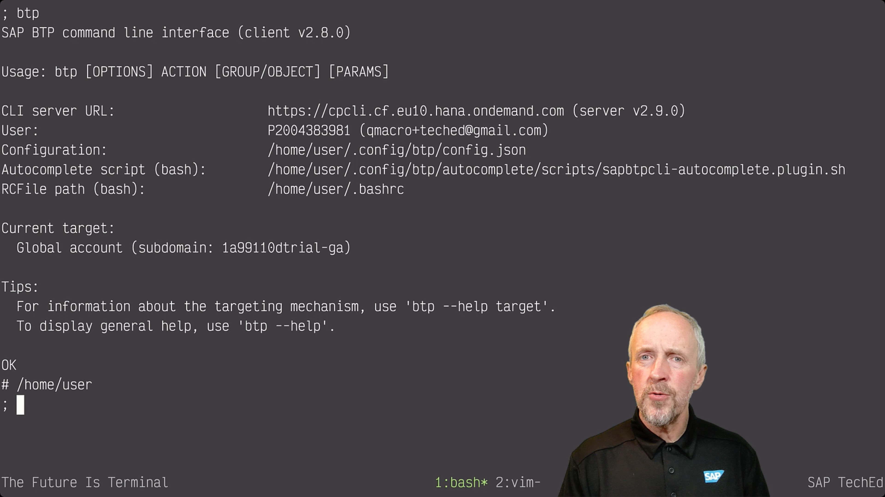

# The Power of CLI

This is the directory containing the draft artifacts for the "CLI power" slot. There's a [demo video recording](https://sap.sharepoint.com/:v:/r/sites/100499/advocates/Shared%20Documents/203-Projects/TechEd%202021/Keynote%20Videos/dja-cli-power.mp4?csf=1&web=1&e=Xg2A1V) of the slot stored in the [Documents > 203-Projects > TechEd 2021](https://sap.sharepoint.com/:f:/r/sites/100499/advocates/Shared%20Documents/203-Projects/TechEd%202021?csf=1&web=1&e=5CtfZa) area in Sharepoint.

There are two draft scripts in this directory:

* [original.md](original.md) contains more content, including the use of the `cf` CLI to create a space in the CF org and instantiate a service instance; I had to leave this out in the end because I couldn't get it all into the 4 minute window
* [short.md](short.md) is a cut down version of the original, and what I used to create the demo video recording referenced above; it doesn't have the `cf` part

The `bgu` script I used is an experimental one called [`btpguid`](https://github.com/qmacro/dotfiles/blob/main/scripts/btp/btpguid) (`bgu` is aliased to this).
