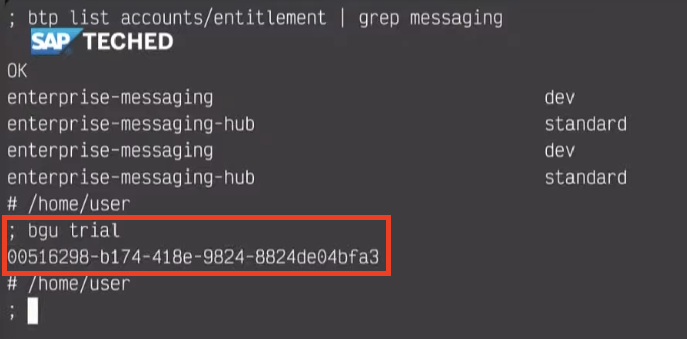
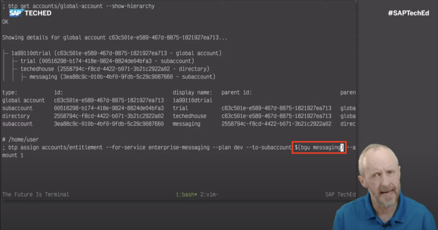

# Getting BTP resource GUIDs with the BTP CLI - part 1

_Learn how to use the btp CLI to determine resource GUIDs in your global account. This post is part 1, covering the `bgu` mechanism._

In the Developer Keynote during SAP TechEd, specifically in the Command Line Magic [section](https://github.com/SAP-samples/teched2021-developer-keynote#sections), I used a little mechanism I called `bgu`, to determine the GUIDs for various resources (a subaccount, and later, a directory) in my global account. Here you can see `bgu` in action:





I wanted to explain what this `bgu` mechanism is, how it works, because it may be useful to you too. And even if the mechanism itself turns out not to be useful for you, the background information and context should provide you with some extra knowledge about BTP and the command line interface tool, `btp`.

## Starting at a high level

The `bgu` mechanism is actually a function in my shell environment, which calls a script called `btpguid`. This in turn uses the btp CLI to examine the global account's resource hierarchy and pick information out of it (specifically the GUID for a given resource name). Let's break that down.

We can ask what `bgu` is with the `type` builtin, which itself is an opportunity for us to enjoy a little bit of meta:

```bash
; type type
type is a shell builtin
```

Anyway, let's ask what `bgu` is:

```bash
; type bgu
bgu is a function
bgu ()
{
    btpguid "$@";
    if [[ $# -gt 1 ]]; then
        btpctx > "$HOME/.status";
    fi
}
```

So there we are, `bgu` is a function that I've defined. All it does is call `btpguid` with all of the arguments that were passed:

```bash
btpguid "$@"
```

Then, depending on circumstances, it calls another script (`btpctx`) to write some info to a status file. This is not relevant here (it's related to my `tmux`-based status line in my terminal) so let's just focus on the call to `btpguid`. What is that? Let's find out:

```bash
; type btpguid
btpguid is /home/user/.dotfiles/scripts/btp/btpguid
```

So `btpguid` is a script. Great, let's have a look at it!

## The btpguid script

```bash
#!/usr/bin/env bash

# btpguid - return BTP subaccount/directory GUIDs

# Usage: btpguid [-t|--target] displayname

# Returns the GUID for the given subaccount or directory, which is
# specified by name. If the option -t or --target is specified, it
# will also set that subaccount or directory as the target.

# Requires the btp CLI. Will direct you to log in first if you're
# not already logged in.

# It uses the detail from the output of this command:
# btp get accounts/global-account --show-hierarchy

# The output looks like this:

# Showing details for global account af39080b-1527-40a1-b78a-3b605af7e811...
#
# ├─ c35b11e4trial (af39080b-1527-40a1-b78a-3b605af7e811 - global account)
# │  ├─ trial (b6501bff-e0ac-4fdf-8898-81f305d25335 - subaccount)
# │  ├─ techedhouse (e57c5b13-9480-4a68-9c04-a603d7a017a9 - directory)
#
# type:            id:                                    display name:   parent id:
# global account   af39080b-1527-40a1-b78a-3b605af7e811   c35b11e4trial
# subaccount       b6501bff-e0ac-4fdf-8898-81f305d25335   trial           af39080b-...
# directory        e57c5b13-9480-4a68-9c04-a603d7a017a9   techedhouse     af39080b-...

# It's the second part of the output (the table) that is used.

# Uses the "${2:-$1}" technique seen in fff - see
# https://qmacro.org/autodidactics/2021/09/03/exploring-fff-part-1-main/
# for details.

gethier() {
  btp get accounts/global-account --show-hierarchy 2> /dev/null
}

main() {

  local hierarchy subtype guid displayname rc=0

  displayname="${2:-$1}"

  [[ -z $displayname ]] && {
    echo "No display name specified"
    exit 1
  }

  hierarchy="$(gethier)" || { btp login && hierarchy="$(gethier)"; }
  read -r subtype guid <<< "$(grep -P -o "^(subaccount|directory)\s+(\S+)(?=\s+$displayname)" <<< "$hierarchy")"

  # Set the subtype as target if requested
  [[ $1 == -t ]] || [[ $1 == --target ]] && {
    btp target "--${subtype}" "$guid" &> /dev/null
    rc=$?
  }

  echo "$guid"
  return $rc

}

main "$@"
```

Hopefully the comments provide the general idea - given the name of a resource, say "trial" or "techedhouse", this script will find and return that resource's GUID. In addition, if the `--target` option is specified, it will also [set the default command context](https://help.sap.com/products/BTP/65de2977205c403bbc107264b8eccf4b/720645a3ed3945bd8d97a670b948ac07.html?locale=en-US), but we'll leave that for another time.

## An overview of structure in BTP

Before we dig in to some of the details of the script, let's just spend a few moments thinking about subaccounts and the hierarchies that can be built using directories.

Basically, within a global account, you can create subaccounts, and you can set up those subaccounts using directories. This is a flexible and simple way to organise resources, assignments, adminstrative access and more using a well understood paradigm.

You can read more about this on the SAP Help Portal in [Account Models With Directories and Subaccounts [Feature Set B]](https://help.sap.com/products/BTP/df50977d8bfa4c9a8a063ddb37113c43/b5a6b58694784d0c9f4ff85f9b7336dd.html?locale=en-US).
