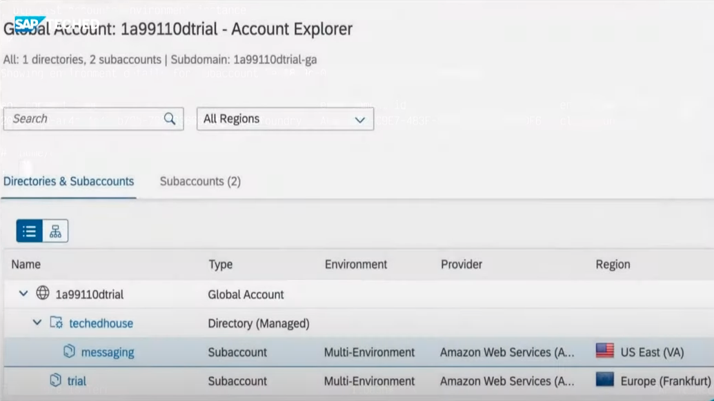

# Getting BTP resource GUIDs with the btp CLI - part 1

_Learn how to use the btp CLI to determine resource GUIDs in your global account. This post is part 1, covering the `bgu` mechanism._

In the [Developer Keynote](https://reg.sapevents.sap.com/flow/sap/sapteched2021/portal/page/sessions/session/1632238684525001QKhY) during SAP TechEd, specifically in the Command Line Magic [section](https://github.com/SAP-samples/teched2021-developer-keynote#sections), I used a little mechanism I called `bgu` (for "btp GUID"), to determine the GUIDs for various resources (a subaccount, and later, a directory) in my global account. Here you can see `bgu` in action:


(In case you're interested in re-watching this section of the Developer Keynote, there's a link in the [Further reading and viewing](#furtherreading) section later.)

In this post I explain what this `bgu` mechanism is and how it works, because it may be useful to you too. Moreover, the background information and context should provide you with some extra knowledge about BTP and the command line interface tool, `btp`.

## Starting at a high level

The `bgu` mechanism is actually a function in my shell environment, which calls a script called `btpguid`. This in turn uses the btp CLI to examine the global account's resource hierarchy and pick information out of it - specifically the GUID for a given resource name. Let's break that down.

We can ask what `bgu` is with the Bash shell's `type` builtin. This itself is an opportunity for us to enjoy a little bit of meta before we start, by asking what the type of `type` is:

```bash
; type type
type is a shell builtin
```

Anyway, enough of that, let's ask what `bgu` is:

```bash
; type bgu
bgu is a function
bgu ()
{
    btpguid "$@";
    if [[ $# -gt 1 ]]; then
        btpctx > "$HOME/.status";
    fi
}
```

So there we are, `bgu` is a function that I've defined and made available in my shell. All it does is call `btpguid` with all of the arguments that were passed:

```bash
btpguid "$@"
```

Then, depending on circumstances, it calls another script (`btpctx`) to write some info to a status file. This is not relevant here (it's related to my `tmux`-based status line in my terminal) so let's just focus on the call to `btpguid`.

So what is `btpguid`? Let's find out:

```bash
; type btpguid
btpguid is /home/user/.dotfiles/scripts/btp/btpguid
```

So `btpguid` is a script. Great, let's have a look at it!

## The btpguid script

```bash
#!/usr/bin/env bash

# btpguid - return BTP subaccount/directory GUIDs

# Usage: btpguid [-t|--target] displayname

# Returns the GUID for the given subaccount or directory, which is
# specified by name. If the option -t or --target is specified, it
# will also set that subaccount or directory as the target.

# Requires the btp CLI. Will direct you to log in first if you're
# not already logged in.

# It uses the detail from the output of this command:
# btp get accounts/global-account --show-hierarchy

# The output looks like this:

# Showing details for global account af39080b-1527-40a1-b78a-3b605af7e811...
#
# ├─ c35b11e4trial (af39080b-1527-40a1-b78a-3b605af7e811 - global account)
# │  ├─ trial (b6501bff-e0ac-4fdf-8898-81f305d25335 - subaccount)
# │  ├─ techedhouse (e57c5b13-9480-4a68-9c04-a603d7a017a9 - directory)
#
# type:            id:                                    display name:   parent id:
# global account   af39080b-1527-40a1-b78a-3b605af7e811   c35b11e4trial
# subaccount       b6501bff-e0ac-4fdf-8898-81f305d25335   trial           af39080b-...
# directory        e57c5b13-9480-4a68-9c04-a603d7a017a9   techedhouse     af39080b-...

# It's the second part of the output (the table) that is used.

# Uses the "${2:-$1}" technique seen in fff - see
# https://qmacro.org/autodidactics/2021/09/03/exploring-fff-part-1-main/
# for details.

gethier() {
  btp get accounts/global-account --show-hierarchy 2> /dev/null
}

main() {

  local hierarchy subtype guid displayname rc=0

  displayname="${2:-$1}"

  [[ -z $displayname ]] && {
    echo "No display name specified"
    exit 1
  }

  hierarchy="$(gethier)" || { btp login && hierarchy="$(gethier)"; }
  read -r subtype guid <<< "$(grep -P -o "^(subaccount|directory)\s+(\S+)(?=\s+$displayname)" <<< "$hierarchy")"

  # Set the subtype as target if requested
  [[ $1 == -t ]] || [[ $1 == --target ]] && {
    btp target "--${subtype}" "$guid" &> /dev/null
    rc=$?
  }

  echo "$guid"
  return $rc

}

main "$@"
```

Hopefully the comments provide the general idea - given the name of a resource, say "trial" or "techedhouse", this script will find and return that resource's GUID. In addition, if the `--target` option is specified, it will also [set the default command context](https://help.sap.com/products/BTP/65de2977205c403bbc107264b8eccf4b/720645a3ed3945bd8d97a670b948ac07.html?locale=en-US), but we'll leave that for another time.

## An overview of structure in BTP

Before we dig in to some of the details of the script, let's just spend a few moments thinking about subaccounts and the hierarchies that can be built using directories.

Basically, within a global account, you can create subaccounts, and you can set up those subaccounts using directories. This is a flexible and simple way to organise resources, assignments, adminstrative access and more using a well understood paradigm.

You can read more about this on the SAP Help Portal in [Account Models With Directories and Subaccounts [Feature Set B]](https://help.sap.com/products/BTP/df50977d8bfa4c9a8a063ddb37113c43/b5a6b58694784d0c9f4ff85f9b7336dd.html?locale=en-US).

Let's look at an example. The structure that existed at the end of the Command Line Magic section of the Developer Keynote looked like this:

```
├─ 1a99110dtrial (c63c501e-e589-467d-8875-1821927ea713 - global account)
│  ├─ trial (00516298-b174-418e-9824-8824de04bfa3 - subaccount)
│  ├─ techedhouse (2558794c-f8cd-4422-b071-3b21c2922a02 - directory)
│  │  ├─ messaging (3ea88c9c-010b-4bf0-9fdb-5c29c9087660 - subaccount)
```

We saw, very briefly, a representation of this structure in the BTP cockpit too, right at the end of this section of the keynote:



Staring at this structure for a few seconds, we see that it's made up of directories and subaccounts; the "messaging" subaccount sits within the "techedhouse" directory, which itself sits alongside (at the same level as) the default "trial" subaccount that was set up automatically for me when my global account was created.

## Resources, GUIDs and command substitution

When managing these subaccount and directory resources, GUIDs are used. We saw multiple examples where GUIDs are required - here are three of them. However, note that each time, instead of finding and specifying a GUID manually, a [command substitution](https://www.gnu.org/software/bash/manual/html_node/Command-Substitution.html) (they look like this: `$(...)`) is used, to make things easier:

* [Reducing quota for a subaccount](https://github.com/SAP-samples/teched2021-developer-keynote/tree/main/section/command-line-magic#reducing-existing-entitlement-quota-to-zero): `btp assign accounts/entitlement --for-service enterprise-messaging --plan dev --to-subaccount $(bgu trial) --amount 0`

* [Assigning quota to a directory](https://github.com/SAP-samples/teched2021-developer-keynote/tree/main/section/command-line-magic#assigning-service-quota-to-directory): `btp assign accounts/entitlement --for-service enterprise-messaging --plan dev --to-directory $(bgu techedhouse) --amount 1 --auto-assign`

* [Creating the subaccount within a directory](https://github.com/SAP-samples/teched2021-developer-keynote/tree/main/section/command-line-magic#creating-the-new-subaccount): `btp create accounts/subaccount --region us10 --display-name messaging --beta-enabled true --subdomain $(uuidgen) --directory $(bgu techedhouse)`

In each case, instead of manually looking up the GUID for a resource, and then copy-pasting that in for the value to use with `--to-subaccount`, `--to-directory` and `--directory` above, the `bgu` mechanism was used to do that for us. As the [manual section on command substitution](https://www.gnu.org/software/bash/manual/html_node/Command-Substitution.html) says:

> "_command substitution allows the output of a command to replace the command itself_"

In other words, when you see something like this (taken from the first example above):

```
--to-subaccount $(bgu trial)
```

then what happens is that the command `bgu trial` is executed, and the output is then substituted as the value for the `--to-subaccount` parameter.

(In case you're wondering, command substitution comes in two forms: ```...``` and `$(...)`; the former is now deprecated.)

## Determining the GUIDs

Now that we understand the structure of resources in BTP accounts, we can turn our attention to the heart of the `btpguid` script. This incarnation of the script, which was used in the Developer Keynote, invokes a btp CLI command (which we'll see shortly), and parses some of its output:

```
hierarchy="$(gethier)" || { btp login && hierarchy="$(gethier)"; }
read -r subtype guid <<< "$(grep -P -o "^(subaccount|directory)\s+(\S+)(?=\s+$displayname)" <<< "$hierarchy")"
```

Let's break that down so we understand what's going on.

The first line executes the `gethier` function which is defined earlier in the script.

> In case you're wondering about the rest of the first line, this is to deal with the situation where you're not yet (or no longer) logged in with `btp`, and if that's the case, you're guided to log in first, and then the call is re-tried.

The `gethier` function just runs the following `btp` command:

```bash
btp get accounts/global-account --show-hierarchy 2> /dev/null
```

> I'm redirecting standard error (with `2>`) to `/dev/null`, to get rid of anything printed there. Currently the btp CLI outputs an "OK" to standard error, and I don't want to see that anywhere.

The `--show-hierarchy` parameter is responsible for the lovely detail that you saw earlier. Let's look at an example of that detail before diving into the second line, so we know what we're dealing with. This example is from the script's comments above:

```
Showing details for global account af39080b-1527-40a1-b78a-3b605af7e811...

├─ c35b11e4trial (af39080b-1527-40a1-b78a-3b605af7e811 - global account)
│  ├─ trial (b6501bff-e0ac-4fdf-8898-81f305d25335 - subaccount)
│  ├─ techedhouse (e57c5b13-9480-4a68-9c04-a603d7a017a9 - directory)

type:            id:                                    display name:   parent id:
global account   af39080b-1527-40a1-b78a-3b605af7e811   c35b11e4trial
subaccount       b6501bff-e0ac-4fdf-8898-81f305d25335   trial           af39080b-...
directory        e57c5b13-9480-4a68-9c04-a603d7a017a9   techedhouse     af39080b-...
```

Right, so what is the second line doing? From a high level, it's looking for lines in this output starting with either "subaccount" or "directory", grabbing the GUID and resource type on the line that's found, and assigning them to two variables, `guid` and `subtype` respectively:

```bash
read -r subtype guid <<< "$(grep -P -o "^(subaccount|directory)\s+(\S+)(?=\s+$displayname)" <<< "$hierarchy")"
```

It looks a little complex, but if you stare at it for a few minutes, this pattern emerges:

> read [into two variables] from the results of searching and extracting values from the hierarchy data

A couple of "here strings" in the form of the `<<<` construct are used (see section 3.6.7 of the [Bash manual section on redirections](https://www.gnu.org/software/bash/manual/html_node/Redirections.html)). Such "here strings" allow us to supply the value of a variable as input data to a command or builtin that would normally expect to read from standard input (STDIN). If you're interested in understanding here strings and how they fit in, have a look at [Input/output redirection, here documents and here strings](https://qmacro.org/autodidactics/2021/11/07/exploring-fff-part-2-get-ls-colors/#ioredirection).

Knowing this, we can break the line down into parts. The first part is this, inside the command substitution construct `$(...)`:

```bash
grep -P -o "^(subaccount|directory)\s+(\S+)(?=\s+$displayname)" <<< "$hierarchy"
```

Here are some notes to help you interpret this:

|Part|Description|
|-|-|
|`grep`|this is the command to search for patterns in data|
|`-P`|this tells `grep` that we're going to use a Perl Compatible Regular Expression (PCRE)|these are the most powerful and flexible and include the [positive lookahead assertion](https://www.regular-expressions.info/lookaround.html) construct `(?=...)`|
|`-o`|this tells `grep` to output not the entire matched line, but only the parts that are matched and captured (via parentheses)|
|`"$hierarchy"`|this is the value of the `hierarchy` variable that holds the output from `btp get accounts/global-account --show-hierarchy`|
|`^`|this anchors the pattern to the beginning of the line (in other words, either "subaccount" or "directory" needs to be right at the start of the line for the match to be successful)|
|`\s` and `\S`|these are very common metacharacters used in regular expressions, and represent "a whitespace character" and "anything but a whitespace character" respectively|
|`+`|this is a modifier which represents "at least one, possibly more" and is different from `\*` which is "zero or more" and `?` which means "optional (i.e. either no occurrence or just one occurrence)"|
|`$displayname`|because the entire pattern is enclosed in double quotes (`"..."`) the shell will substitute the value of this variable into the pattern; the variable holds the value specified when `btpguid` is invoked, i.e. the name of the resource we're looking for|
|`(...)`|these are matching parentheses, called "capturing groups", to identify and grab what we want from the match|
|`(?=...)`|this is a positive lookahead assertion which allows us to say things like "must be followed by" without consuming anything in the match; note also that despite there being parentheses, this is not itself a capturing group and therefore what's being asserted is not grabbed|
|`<<<`|this is a here string construct that provides the input to `grep` from the value of the `hierarchy` variable instead of from standard input|

With that in mind, let's look again at the pattern, in quotes:

```
"^(subaccount|directory)\s+(\S+)(?=\s+$displayname)"
```

If the `displayname` variable contains "techedhouse", then, after parameter substitution within these double quotes (i.e. at the shell level), we have this as the actual pattern:

```
^(subaccount|directory)\s+(\S+)(?=\s+techedhouse)
```

Spoken out loud we might say: _the line must start with either 'subaccount' or 'directory' right at the beginning, and whichever it is, we want to capture it; that must be directly followed by at least one whitespace character (`\s+`), followed by at least one non-whitespace character (`\S+`), and we want to capture those non-whitespace characters\*; oh, but also this must be followed (`(?=`) by at least one whitespace character (`\s+`) and then 'techedhouse'_.

\* those non-whitespace characters will be the GUID

Let's test this out manually, to see what happens. Let's assume that we're looking for the GUID of a resource with a display name of "techedhouse":

```bash
; btp get accounts/global-account --show-hierarchy 2>/dev/null \
  | grep -P -o '^(subaccount|directory)\s+(\S+)(?=\s+techedhouse)'
directory        2558794c-f8cd-4422-b071-3b21c2922a02
```

Note that the whitespace and "techedhouse" inside the positive lookahead assertion (i.e. `(?=\s+techedhouse)`) is not captured and therefore we don't see it as a third value in the output.

With the two values output like this:

```
directory        2558794c-f8cd-4422-b071-3b21c2922a02
```

we can better understand what's happening with the `read` builtin; let's substitute the output to see it in action:

```bash
read -r subtype guid <<< "directory        2558794c-f8cd-4422-b071-3b21c2922a02"
```

And guess what - after this, the `subtype` variable will contain "directory" and the `guid` variable will contain "2558794c-f8cd-4422-b071-3b21c2922a02". And then with the `echo` a little bit further on in the script, this GUID is emitted to standard output before the script ends. Nice!

In case you're wondering about the `-r` option to the `read` builtin, it's to stop any backslashes in the input being interpreted inappropriately. I wrote about this in a recent post on my [Autodidactics blog](https://qmacro.org/autodidactics/) - see [The read command](https://qmacro.org/autodidactics/2021/11/07/exploring-fff-part-2-get-ls-colors/#readcommand) section of [Exploring fff part 2 - get_ls_colors](https://qmacro.org/autodidactics/2021/11/07/exploring-fff-part-2-get-ls-colors/).

## Wrapping up this part

We can see how the power of the [Unix Philosophy](https://en.wikipedia.org/wiki/Unix_philosophy) helps us prepare, run, and handle output of executables on the command line. Here we put together just a few lines to help us level up and be even more efficient, by allowing us to determine our SAP Business Technology Platform account's resource GUIDs with zero effort, and use those determined GUIDs in the context of other commands.

In part 2 we'll learn a little bit more about the Unix Philosophy and then examine alternative output formats for complex data structures and relationships; formats that are more predictable and - with the right tools - more reliably parseable.

<a name="furtherreading"></a>
## Further reading and viewing

Here's a quick list of resources that you may wish to consume, relating to what you've read in this post:

* The replay of the SAP TechEd Developer Keynote itself: [Improve Developers' Lives: Developer Keynote and Open Discussion](https://www.youtube.com/watch?v=kOFuwDSXBZg)
* A link to the part of that Developer Keynote replay which goes directly to the relevant demo part: [Command Line Magic](https://youtu.be/kOFuwDSXBZg?t=193)
* The SAP btp CLI branch of our SAP Tech Bytes repository on GitHub, which has links to related blog posts: [SAP btp CLI](https://github.com/SAP-samples/sap-tech-bytes/tree/2021-09-01-btp-cli)
* The official place to download the btp CLI: [SAP Development Tools - Cloud](https://tools.hana.ondemand.com/#cloud)
* A script that will download, unpack and set up the btp CLI for you: [getbtpcli](https://github.com/SAP-samples/sap-tech-bytes/blob/2021-09-01-btp-cli/getbtpcli)
* A mini-series on the SAP btp CLI from the Hands-on SAP Dev show on the SAP Developers YouTube channel: [The SAP btp CLI](https://www.youtube.com/playlist?list=PL6RpkC85SLQDXx827kdjKc6HRvdMRZ8P5)
* A reference manual for Bash: [Bash Reference Manual](https://www.gnu.org/software/bash/manual/html_node/index.html)
* Documentation from the SAP Help Portal: [Setting up a Trial Account via the Command Line [Feature Set B]](https://help.sap.com/products/BTP/65de2977205c403bbc107264b8eccf4b/a21360fa19714751a7c49c796d39ac3d.html?locale=en-US&state=DRAFT&version=Cloud)
* The official SAP btp CLI documentation: [Account Administration Using the SAP BTP Command Line Interface (btp CLI) [Feature Set B]](https://help.sap.com/products/BTP/65de2977205c403bbc107264b8eccf4b/7c6df2db6332419ea7a862191525377c.html?locale=en-US&version=Cloud)
* More deep dives into Bash script arcana: [Exploring fff part 1 - main](https://qmacro.org/autodidactics/2021/09/03/exploring-fff-part-1-main/) and [Exploring fff part 2 - get_ls_colors](https://qmacro.org/autodidactics/2021/11/07/exploring-fff-part-2-get-ls-colors/)
