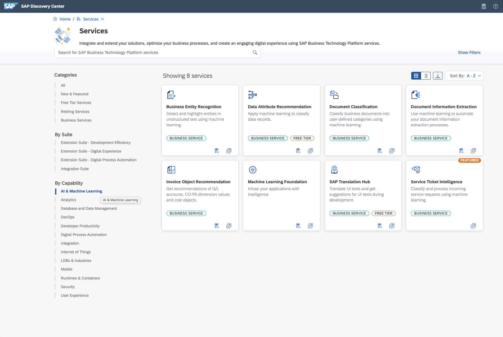
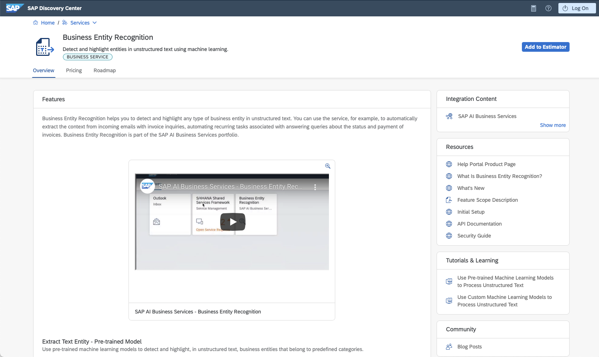
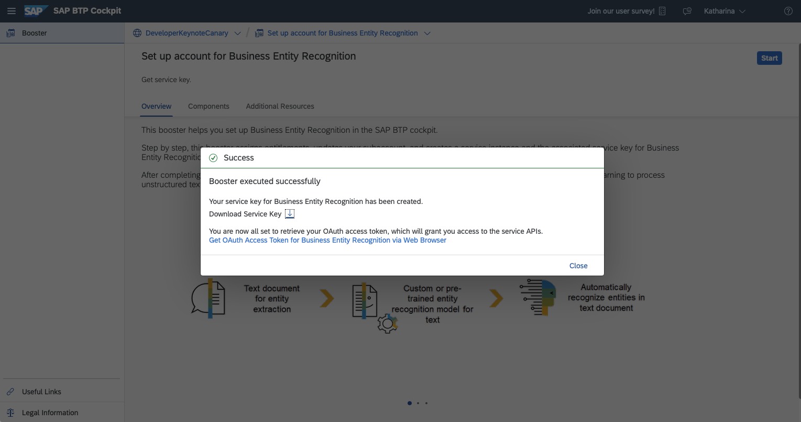

# First inference call is already around the corner for free

> Open on Houseguest full screen in the Diary Room

When talking to my roomates the other day some of them mention that they really would like to to start using AI and integrate into there application. But they do not know where to start or are afraid of being not capable of since they are not a Data Scientiest. Thereby it is pretty simple. 
You can start right away your AI experience by using SAP AI capabilities 


> Transition to demo in the main screen and Diary Room with Houseguest in small window in corner. On screen you see the [Discovery Center](https://discovery-center.cloud.sap/viewServices?category=all) :


To get an overview of what SAP provides you can go to the Discovery Center by using the Filter "AI & Machine Learning".

> Select the "AI & Machine Learning" filter under the By capability filter 



Here you find the  AI reusable assets such as the AI Business Services, but also the AI Foundation that supports you in managing and extend the SAP offering with AI capabilities. 

I will use the Business Entity Recognition service for today that detects and highlight entities in unstructured text, such as in an email.  

> Select Busines Entity Recognition 

BER comes along with a pretrained model but you are also able to train your own custom model with your data.



> Switch to BTP and the global account. 

To setup the service I go to my global account in BTP and use the Booster to speed up the time of setting up the service.

> Describe the click path up to the service plan selection and explain the free service plan

Such as many other services BER has the free service plan that let's you try out the services in your global account without any additional costs and makes the updgrade to paid plan much easier without creating a new service instance.   


Once the setup is done you need to download the service_key which you need to interact with the BER service from your application.



> Download service_key and switch to the jupyter notebook

Now since the service is up and running we can finally start with the fun part and programm our first inference call. Therefore I'm using the python client SDK provided by the Business Entity Recoginition service that you can install via the following command ( btw also the other AI Business Services such as Data Attribute Recommendation and Document Information Extraction/Classification provide a client SDK)

`pip install sap-business-entity-recognition-client-library`

To interact with the BER Rest APi you need to instantiate an BER_API_Client object. The object needs the url, the client_id, the client_secret and the authentication url, which we retrieve from the service_key we downloaded previously. 

```
url = config_json['url']
client_id = config_json['uaa']['clientid']
client_secret = config_json['uaa']['clientsecret']
auth_url = config_json['uaa']['url']
ber_client = ber_api_client.BER_API_Client(url,client_id, client_secret, auth_url)
```

Now we can trigger the first inference job. For this we use the pre-trained model sap_email_business_entity that extract the invoice reference number and the vendor ID from an unstructured text. 
The text we are using is: Hey Big Brother, did you already received my invoice 45678? Cheers, Katharina. 


```
model_name = "sap_email_business_entity"
model_version = 1
text = 'Hey Big Brother, did you already received my invoice 456789. Cheers, Katharina'
```

The text, the model name and the version we pass as inputs into the post_inference_job to trigger the inference call.


```
response = ber_client.post_inference_job(text, model_name, model_version)

Output:

{'data': {'id': '6b03fde5-b9be-4c8a-b783-9acab0dba742',
          'message': 'Inference job has been submitted',
          'modelName': 'sap_email_business_entity',
          'modelVersion': 1,
          'status': 'PENDING'}}
          
pprint(response.json())
inference_jobid = response.json()["data"]["id"]

```
The call returns us a json that contains the inference job ID that we need to get the inference result. The result we get by calling the method get_inference_job. 

```
response = ber_client.get_inference_job(inference_jobid)
pprint(response.json())

Output:

{'data': {'createdAt': '2021-09-16T14:02:51Z',
          'id': '6b03fde5-b9be-4c8a-b783-9acab0dba742',
          'modifiedAt': '2021-09-16T14:02:56Z',
          'result': [{'invoiceReferenceNumber': [{'confidence': 0.86,
                                                  'value': '456789'}],
                      'vendorId': []}],
          'status': 'SUCCESS'}}
```
This returns that it has extracted the invoiceReferenceNumber 456789 with a confidence of 0.86. And voila! You had your first interaction with a model. 

> Switch back to the discovery center

And as already said beside the pretrained model you can also train your own model with your data. 
And if you vote for me so that I can stay in the house I can show you how to train your own model with newly introduced AI API which provides you a standard way of ML scenario lifecycle management. If I have to leave the house you have to do by yourself with the help of the nice tutorials. ;-)


