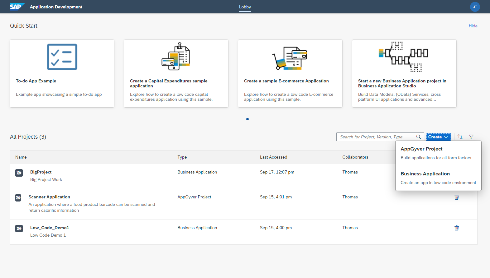
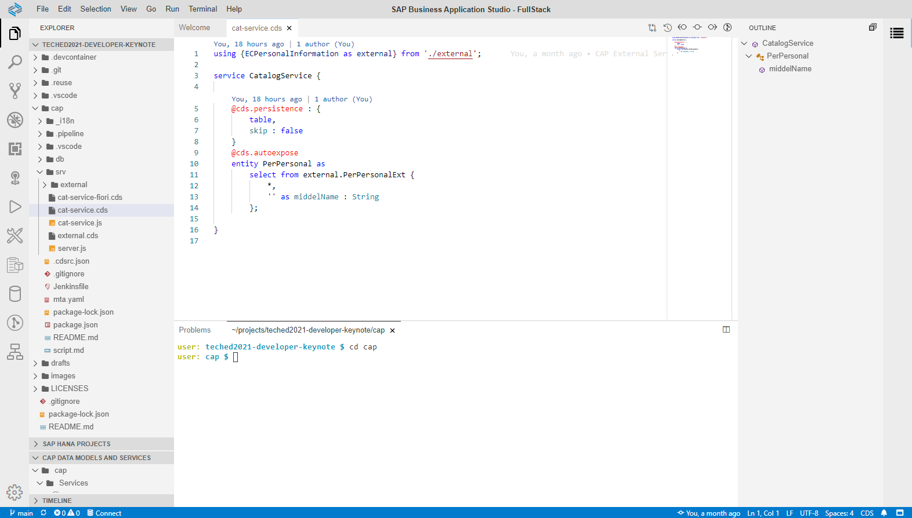
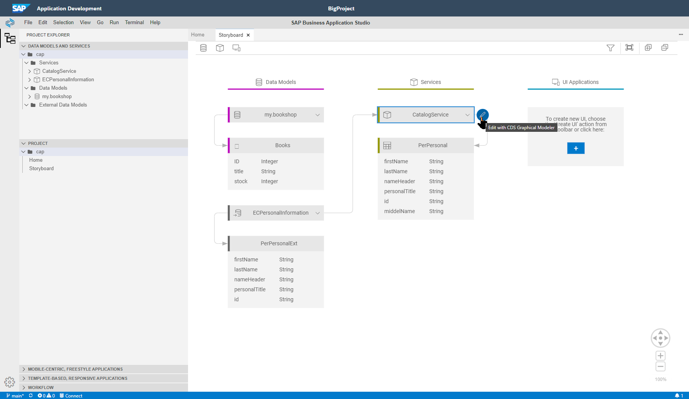
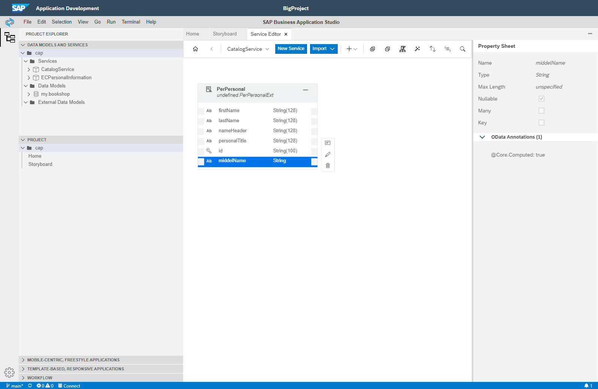
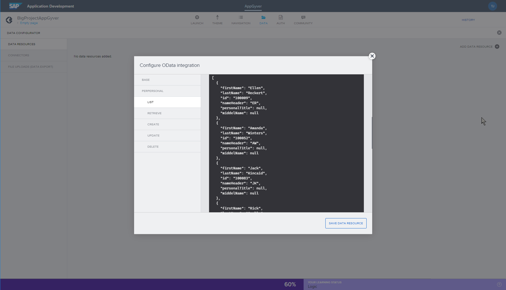
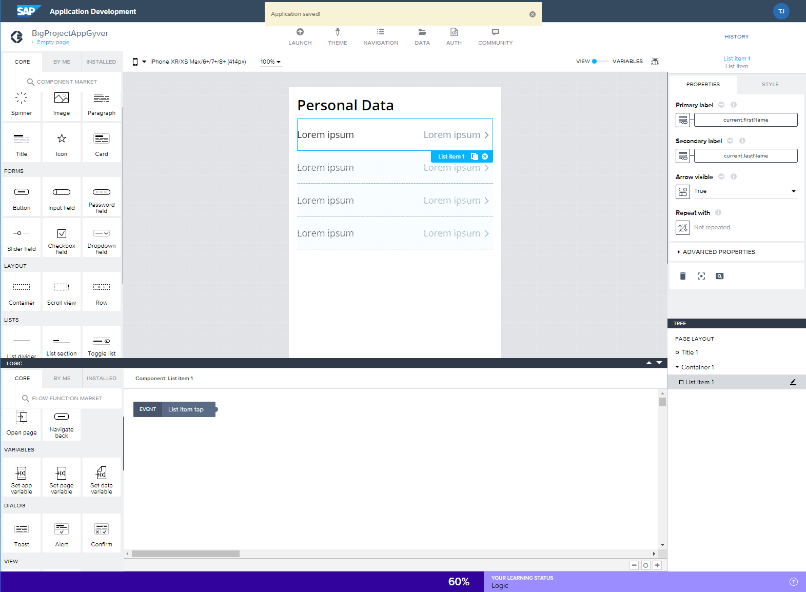
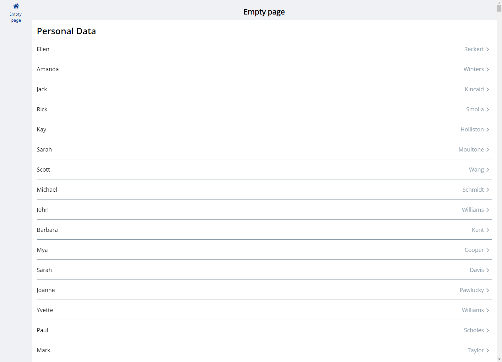

# Low- / No- Code Development

[Video Draft](https://sap.sharepoint.com/sites/100499/advocates/Shared%20Documents/Forms/AllItems.aspx?id=%2Fsites%2F100499%2Fadvocates%2FShared%20Documents%2F203%2DProjects%2FTechEd%202021%2FKeynote%20Videos%2FTechEd%5FDeveloper%5FKeynote%5Flow%5Fno%5Fcode%5Fdraft%2Emp4&parent=%2Fsites%2F100499%2Fadvocates%2FShared%20Documents%2F203%2DProjects%2FTechEd%202021%2FKeynote%20Videos)

> Open full screen with this intro

As a development manager to this Motley Crew and a former developer myself; I'm constantly tasked with trying to figure out how to increase the amount of new apps and enhancements we can deliver to the business. They constantly want more functionality than our team alone can deliver.  

This is where the trends with Low and No Code development have caught my attention. I'm obviously looking for anything that improves the developer productivity of my team, but also for ways to allow the business to build some of the content themsevles. And while some of these tools certainly look accessible, I need to make sure I'm not unleashing developers that won't be integrated into our environment or standards well. And this is why I got so excited by the new Low and No code offerings from SAP. 

> Transition to the demo. Start in the BTP Cockpit and launch into the Application Development Lobby

I'm going to start here in the new Application Development Lobby of the SAP Business Technology Platform. I like that all of my projects can be viewed in one location regardless if they were created in the SAP Business Application Studio or AppGyver.  

In fact what my team has done is started with the Cloud Application Programming Model application from earlier that extends the SuccessFactors service.  That was originally coded by one of the pro-developers in my team via the SAP Business Application Studio with a full stack development experience. They can directly code in the underlying JavaScript or Java of the CAP programming model and have access to lots of expert tooling and debugging; including command line interface via the embedded terminal.

> Show the Full Stack devspace experience with BAS and a CAP project

But this is where we start to grow the possibilities of who can work with us on the project.  Going back to the Application Development Lobby we can open this exact same CAP project in the new Low-Code version of the SAP Business Application Studio. It has a simplified interface with a graphical Storyboard and guided editors.  So someone who understands data modeling but not necessary Java or JavaScript could extend and finish the work that our development team already began.  

They can even preview and deploy the application without ever having to deal with technical complexities like package.json or mta.yaml files. 

But now that we have our service deployed, we want to develop a mobile UI.  This is where AppGyver can be doubly helpful. There's many a backend application developer that has little to no experience with frontend or expecially mobile development.  But AppGyver is such a simple tool that both professional developers with little frontend experience and business experts could both build flexible UIs.

> Switch to AppGyver and Configure OData Integration

We start by importing the OData service endpoint which we deployed from the Low Code Business Application Studio. 

<Pause>

We can then drag and drop to design our UI and bind the controls with the data set returned from the OData service.

<Pause>

In in minutes we have a mobile enabled applciation consuming our CAP service previewed in the Web Browser or directly on mobile device.

Needless to say I'm excited by the possibilites here. We started the project within our development team and built the more complex parts of the service consumption logic in JavaScript.  Then a business domain expert was able to finish the data model definition using low code tooling.  Finally a team member that had zero expeirence with mobile development was able to build out an iOS and Android UI in just hours. 
