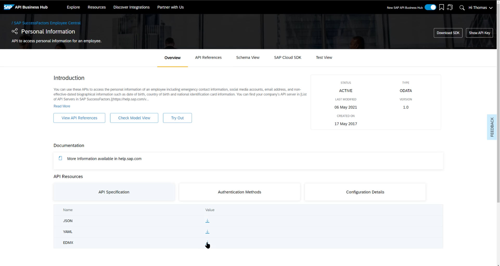
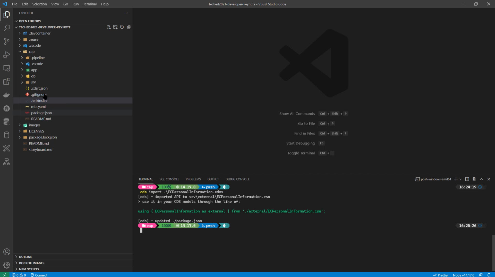
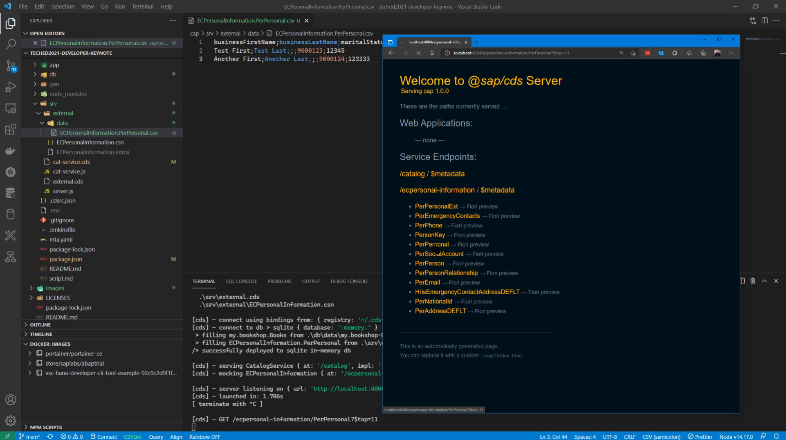
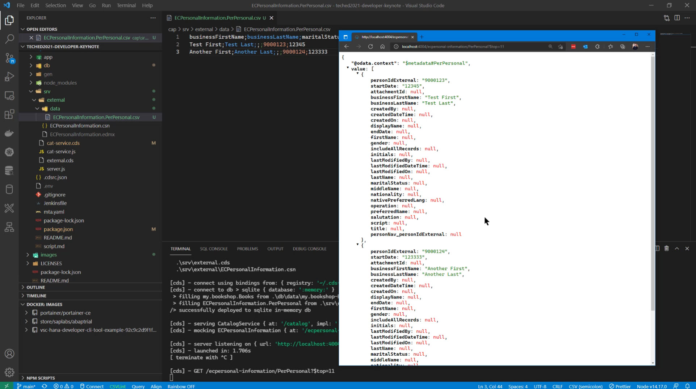
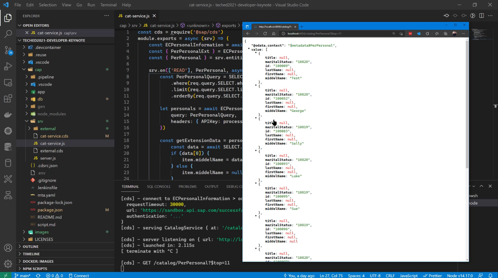

# SAP Cloud Application Programming Model Consuming Remote Services

Often in SAP Cloud Application Programming Model samples and other content, we focus on the ability to model and create OData services. However CAP also has some amazing functionality to help with the consumption of services from other systems. Or to create a mashup of local data and remote data fetched via a service call. This demo portion of the SAP TechEd 2021 Developer Keynote will focus on exactly those aspects of the SAP Cloud Application Programming Model.

[Original Demo in Developer Keynote](https://www.youtube.com/watch?v=kOFuwDSXBZg&t=1663s)

[Extended "Director's Cut" with behind the scenes and new experimental content](https://www.youtube.com/watch?v=rWQFbXFEr1M)

## Importing the External Service Definition

First we need to find the details of the external API we want to call. In this demo scenario we want to consume a SuccessFactors Personal Information and then add one of our own fields to the new service which we will persist locally in our CAP application.

To begin, I go to the SAP API Business Hub, find the SuccessFactors API I need as my starting point and download the EDMX specification file into a new, empty CAP project.

[SAP SuccessFactors Employee Central Personal Information](https://api.sap.com/api/ECPersonalInformation/overview)



I then return to my development environment. In this demo I'm using VSCode for local development but you could use this same flow and tooling in the SAP Business Application Studio. 

From the command line I can use the CAP CLI to import that external service definition into my project.



This converts the specification into CSN or Schema Notation and adjusts my project's [package.json](./package.json#L53-L65) with technical configuration to connect to the service.  It allows me to mock the service locally while I develop with data from a CSV file.





## Creating the Mashup Service Definition

Like most of the APIs you are going to find, this one contains a lot of fields. Afterall these APIs have to cover every usage situation. But CAP has this cool mechanims to extend a service and then mashup an existing entity - [external.cds](./srv/cat-service.cds). I'm going to take this entity from the external service and cut it down to just the 5 fields I want and in doing so also change the names of the fields.

``` cds
   @cds.persistence : {
        table,
        skip : false
    }
    @cds.autoexpose
    entity PerPersonal as
    projection on external.PerPersonal {
        firstName,
        lastName,
        initials as nameHeader,
        title as personalTitle,
        key personIdExternal as id,
        key startDate,
        '' as middelName : String

    }
```

We can then expose this remote service as our own with the reduced fields and even add a new, Middle Name, field that we will persist separately as part of our extension. 

## Coding the Service Handler

Because this is a mashup of external and extended service, the generic service framework can't just serve it out; but with CAP extension handlers and the embedded SAP Cloud SDK, we can make all of that happen in just a few lines of code.

[cat-service.js](./srv/cat-service.js)

When someone requests our new mashup/extended service it first will forward that request to the SuccessFactors API.  CAP will take care of translation between OData V2 and V4, the renamed columns; it even makes calling the service as easy as writing a SELECT statement and forwarding all the original request query parameters right into the remove service.

``` javascript
        let PerPersonalQuery = SELECT.from(req.query.SELECT.from)
            .limit(req.query.SELECT.limit)
        if (req.query.SELECT.where) {
            PerPersonalQuery.where(req.query.SELECT.where)
        }
        if (req.query.SELECT.orderBy) {
            PerPersonalQuery.orderBy(req.query.SELECT.orderBy)
        }

        let personal = await ECPersonalInformation.tx(req).send({
            query: PerPersonalQuery,
            headers: {
                APIKey: process.env.APIKey
            }
        })
```

Then after we have all the remote data we need, we can use a nice parallel operation to lookup the locally persisted Middel Name data to enhance the service. 

``` javascript
        const getExtensionData = personals.map(async (item) => {
            const data = await SELECT.from(PerPersonal).where({ id: item.id })
            if (data[0]) {
                item.middelName = data[0].middelName
            } else {
                item.middelName = null
            }
            return item
        })
        const personalsWithExtension = await Promise.all(getExtensionData)
```

To the applications calling our extended service they never know that we forwarded their request to a remote SuccessFactors system, or that it is actually OData V2 based or that we reduced the service, renamed the columns or added some of our own extended data to it.  All they see is the final service with all the data they want and need in one place.


