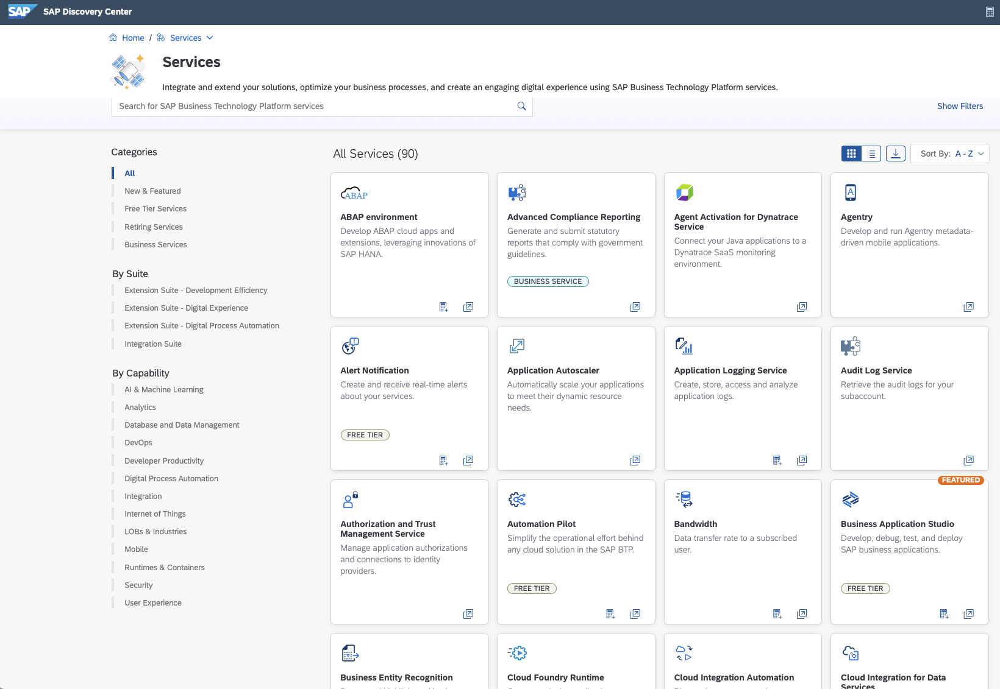
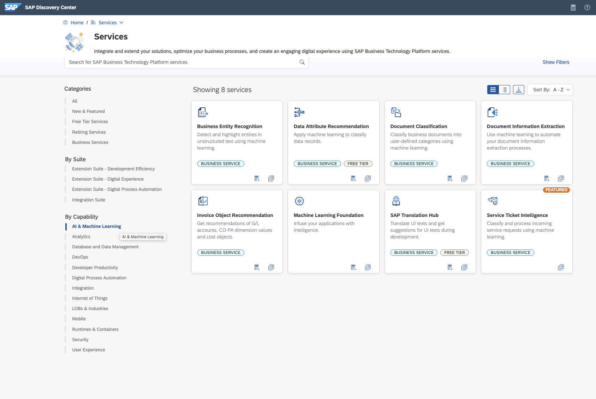
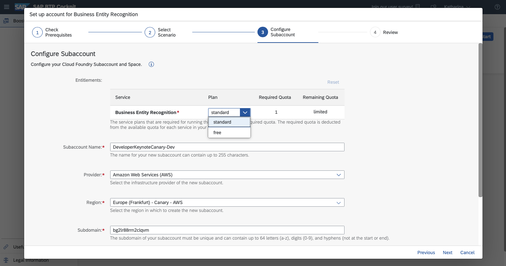
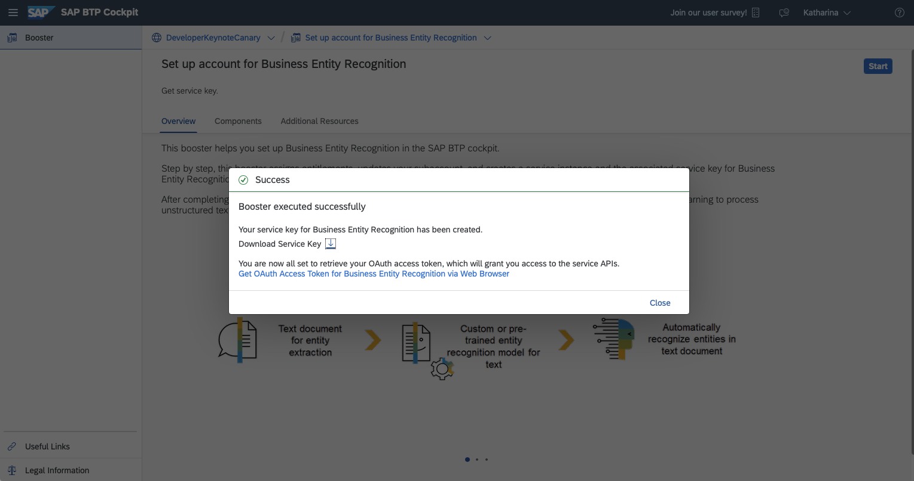

# First steps with AI

Your first steps with AI are just around the corner - for free.

I don't know what Marius' problem is with Josh. He did know that he was coming into a house with eight other developers!

> Open on Houseguest full screen in the Diary Room

When talking to my teammates the other day some of them mentioned they are annoyed of the manual, repetitive tasks they have to do every day and would like to optimise those by using AI. But they do not know where to start since they are not a Data Scientists. Although it is pretty simple to get started with - also as a developer.

Let me show you that your first AI call is just around the corner and you can get it for free.

> Transition to demo in the main screen and Diary Room with Houseguest in small window in corner. On screen you see the [Discovery Center](https://discovery-center.cloud.sap/viewServices?category=all) : 00:56


In the Discovery Center you get an overview of SAP AI technology offered via the Business Technology Platform.

> Select the "AI & Machine Learning" filter under the By capability filter


There  you find the AI Business Services which are reusable and support you in automating corporate processes. They address common SAP needs like to classify data records or customer service requests or to automate your document information extraction processes;

Or you can build your own chatbot by using SAP Conversational AI.

And with the newly released AI Core you can handle the execution and operation of your AI assets in a standardized and scalable way.

For the demo I'll use the AI Business Service Business Entity Recognition that detects and highlights entities from unstructured text, such as in an email.
Besides training your custom model with your own data it also comes along with a pretrained models, which gives us a quickstart to use ready-to-go machine learning models very easily. I'll use this later on.

> Switch to BTP and the global account.

To setup the service I go to my global account in BTP and use the Booster to speed up the time of setting up the service.

> Describe the click path up to the service plan selection and explain the free service plan

BER has the free tier option that lets you try out the service in your global account without any costs and allows to upgrade to paid plan very easy too.



Once the setup is done you download the service_key which you need to interact with the BER service from your application.



> Download service_key and switch to the jupyter notebook

Now since the service is up and running, we can start with the fun part and program our first AI inference call. Therefore I'm using the python client SDK provided by the Business Entity Recognition service that you can get from pypi.org. Btw we also offer this for the other AI capabilities mentioned before.

`pip install sap-business-entity-recognition-client-library`

To interact with the BER Rest API you need to instantiate an BER_API_Client object. The object needs few details like  the authentication url, which we retrieve from the service_key we downloaded previously.

```
url = config_json['url']
client_id = config_json['uaa']['clientid']
client_secret = config_json['uaa']['clientsecret']
auth_url = config_json['uaa']['url']
ber_client = ber_api_client.BER_API_Client(url,client_id, client_secret, auth_url)
```

Now we will post the inference job. We use the pre-trained model sap_email_business_entity that extract the invoice reference number and the vendor ID from an unstructured text.
The text to extract the invoice number from is: Hello, I would like to know the status of an invoice. The number is 456789. Regards, Katharina.

```
model_name = "sap_email_business_entity"
model_version = 1
text = 'Hello, I would like to know the status of an invoice. The number is 456789. Regards, Katharina.'
```

The text, the model name and the model version we pass as inputs into the post\_inference\_job to post the inference job.


```
response = ber_client.post_inference_job(text, model_name, model_version)

Output:

{'data': {'id': '6b03fde5-b9be-4c8a-b783-9acab0dba742',
          'message': 'Inference job has been submitted',
          'modelName': 'sap_email_business_entity',
          'modelVersion': 1,
          'status': 'PENDING'}}

pprint(response.json())
inference_jobid = response.json()["data"]["id"]

```
Besides the details around the status of the job and which model where used the response contains the inference job ID that we need to get the inference result. We store the id into the variable inference_jobid and pass it into the method get_inference_job that returns the inference result.


```
response = ber_client.get_inference_job(inference_jobid)
pprint(response.json())

Output:

{'data': {'createdAt': '2021-09-16T14:02:51Z',
          'id': '6b03fde5-b9be-4c8a-b783-9acab0dba742',
          'modifiedAt': '2021-09-16T14:02:56Z',
          'result': [{'invoiceReferenceNumber': [{'confidence': 0.86,
                                                  'value': '456789'}],
                      'vendorId': []}],
          'status': 'SUCCESS'}}
```
The response returns the prediction of the extracted entities. It extracted the invoiceReferenceNumber 456789 with a confidence of 0.86. Et voila! You had your first interaction with AI. See it wasn't so hard.

And this is just the start. E.g. besides the pretrained model you can also train your own model with your own data. How to do that and also to get more hands-on experience about the other SAP AI technology I can only recommend you to explore the SAP Tuturials and start your AI journay right away.


