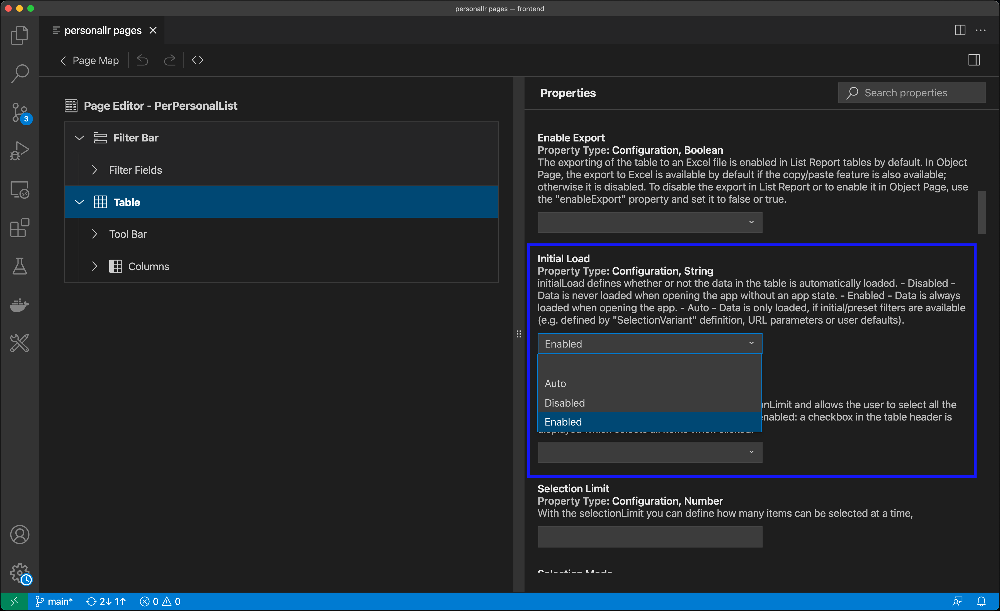
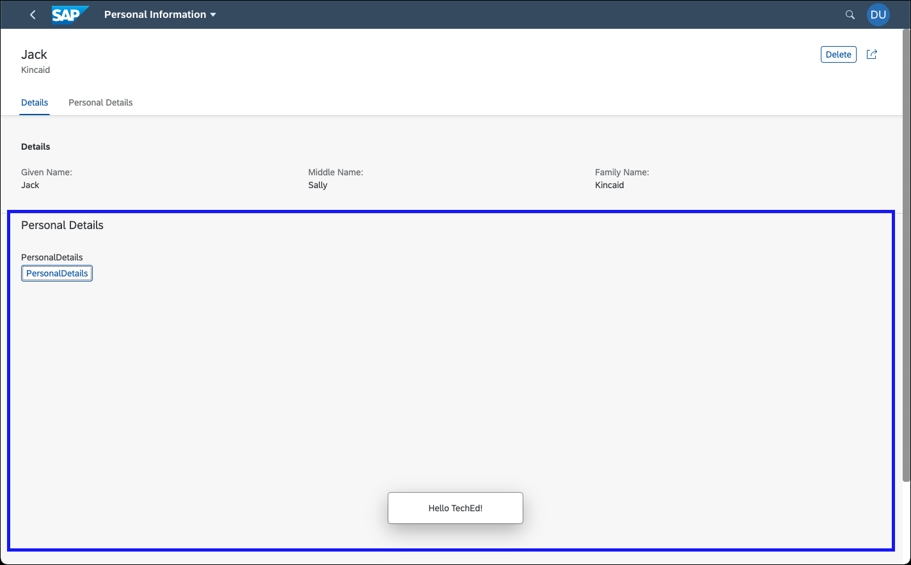
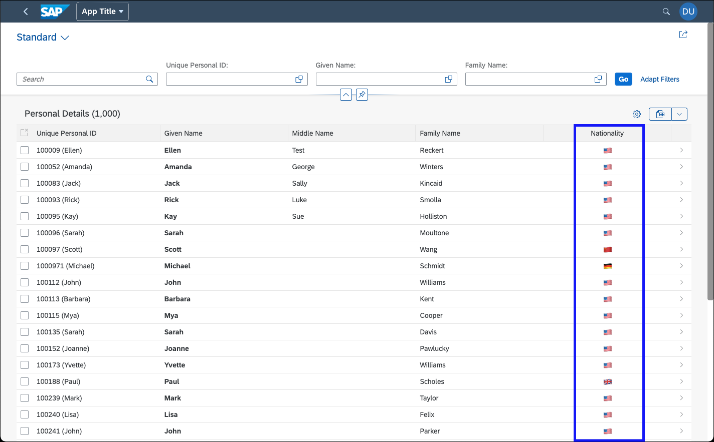

# SAP Fiori Tools

This code builds on top of an existing CAP project from [another demo](../cap)]. In addition to the original project, this directory contains [a customized web application](./app/personal-lr) that uses an SAP Fiori elements List Report Object Page floorplan. This implementation was completed using the SAP Fiori tools to build extensions with the [flexible programming model for SAP Fiori elements apps](https://blogs.sap.com/2021/08/19/leverage-the-flexible-programming-model-to-extend-your-sap-fiori-elements-apps-for-odata-v4/).


# Customizations

## Initial Loading of the Records

The first customization is a property change of the list report's table. There are many properties you can change in the [SAP Fiori Tools Page Map](https://help.sap.com/viewer/17d50220bcd848aa854c9c182d65b699/Latest/en-US/bae38e6216754a76896b926a3d6ac3a9.html). In this case, we changed the default behavior to initially load all records once the list report is open.




## A Custom Section in the Object Page

Furthermore, the page map helps you add [custom sections](https://ui5.sap.com/#/topic/7619517a92414e27b71f02094bd08d06) to an object page and generate the needed files in the ext/fragment folder. If required, it also enables you to add translated strings to the i18n file.




> A running code sample of custom sections can be found in the [SAP Fiori elements Flexible Programming Model Explorer](https://sapui5.hana.ondemand.com/test-resources/sap/fe/core/fpmExplorer/index.html#/customElements/customElementsOverview/customSectionContent).


## A Custom Column in the List Report

Another more complex customization was the addition of a [new column](https://ui5.sap.com/#/topic/28e95702b5854b938ac51c4bc2d078ab) in the list report table. 





For this, we had to add a new fragment and JavaScript file to the `ext` folder and refer to the fragment in the `manifest.json` with the following snippet:

```
"controlConfiguration": {
    "@com.sap.vocabularies.UI.v1.LineItem": {
        "columns": {
            "CustomColumnNationality": {
                "header": "{i18n>Nationality}",
                "horizontalAlign": "Center",
                "position": {
                    "placement": "After",
                    "anchor": "DataField::lastName"
                },
                "template": "personallr.ext.fragment.CustomColumnNationality",
                "availability": "Default",
                "properties": [
                    "nationality"
                ]
            }
        }
    }
}
```


> A running code sample of custom columns can be found in the [SAP Fiori elements Flexible Programming Model Explorer](https://sapui5.hana.ondemand.com/test-resources/sap/fe/core/fpmExplorer/index.html#/customElements/customElementsOverview/customColumnContent).