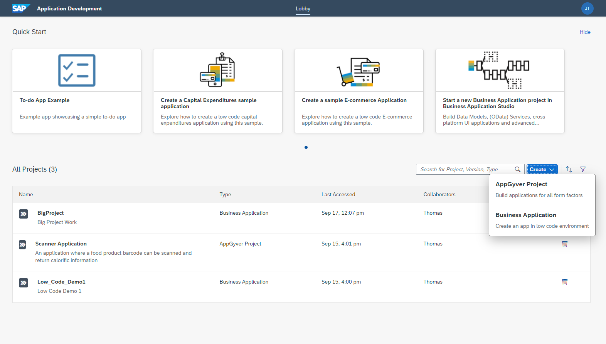
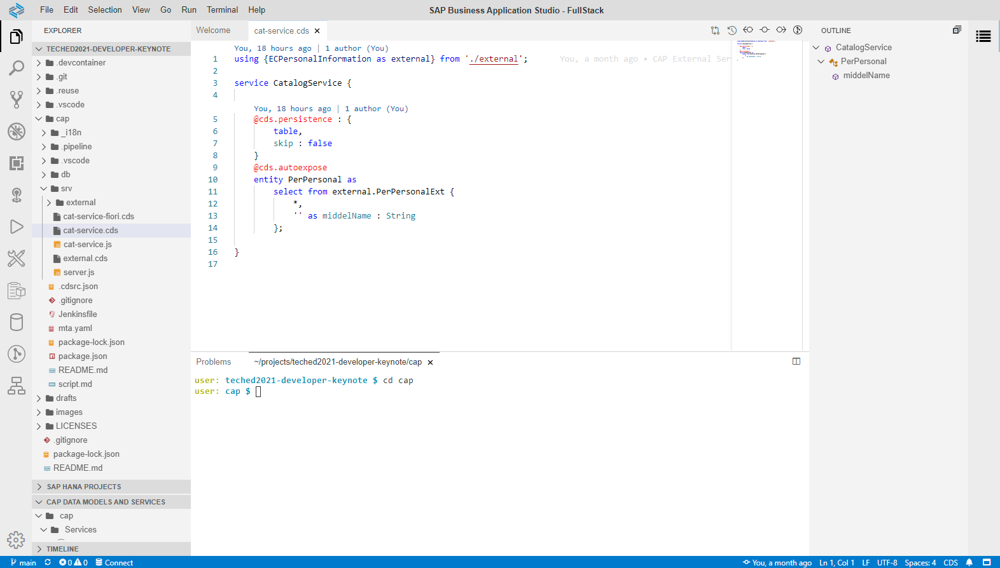
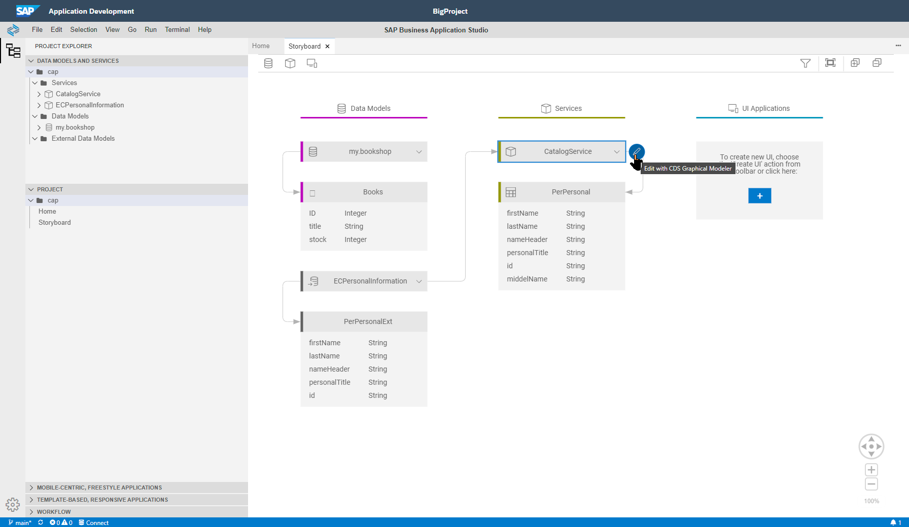
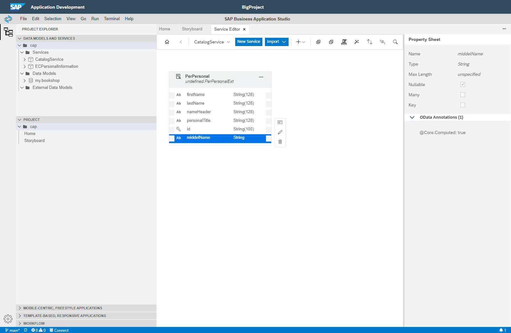
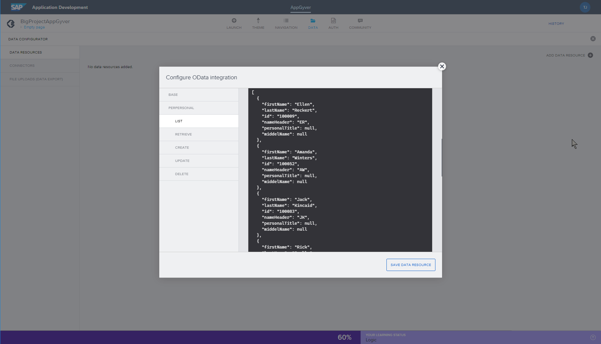
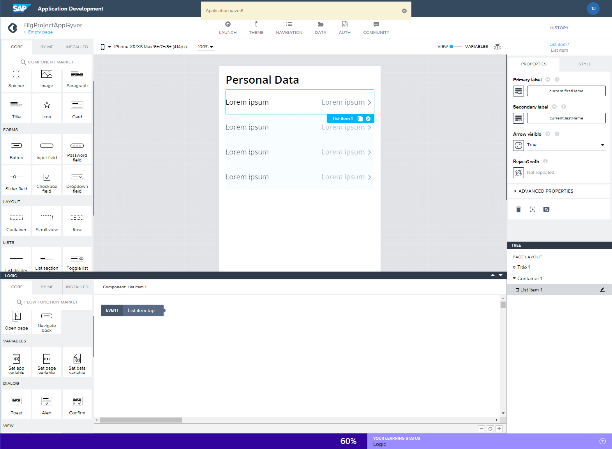
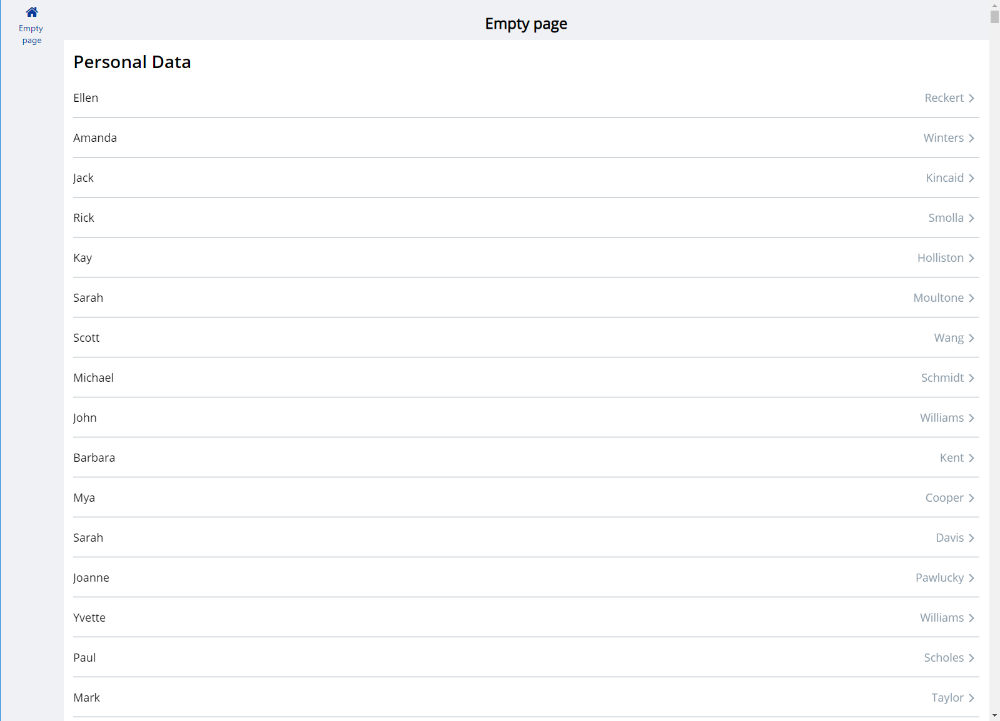

# Low- / No- Code Development

Problem: how to increase the amount of new apps and enhancements a development team can deliver to the business. The business constantly wants more functionality than most teams alone can deliver.  

This is where the trends with Low and No Code development can help. Development teams are looking for anything that improves the developer productivity of their team, but also for ways to allow the business to build some of the content themsevles. And while some of these tools certainly look accessible, they need to make sure they are not unleashing developers that won't be integrated into their environment or standards well. And this is why SAP's new Low and No code offerings are exciting.

## Full Stack Development Experience

The demo starts in the new Application Development Lobby of the SAP Business Technology Platform. All of the projects can be viewed in one location regardless if they were created in the SAP Business Application Studio or AppGyver. 

What has been done is to start with the SAP Cloud Application Programming Model application [from earlier](../cap/README.md) that extends the SuccessFactors service.  That was originally coded by one of the pro-developers via the SAP Business Application Studio with a full stack development experience. They can directly code in the underlying JavaScript or Java of the CAP programming model and have access to lots of expert tooling and debugging; including command line interface via the embedded terminal.

## New Low Code Dev Space in Business Application Studio

But this is where we start to grow the possibilities of who can work with us on the project.  Going back to the Application Development Lobby we can open this exact same CAP project in the new Low-Code version of the SAP Business Application Studio. It has a simplified interface with a graphical Storyboard and guided editors.  So someone who understands data modeling but not necessary Java or JavaScript could extend and finish the work that our development team already began.

They can even preview and deploy the application without ever having to deal with technical complexities like package.json or mta.yaml files. 

## No Code with AppGyver

But now that we have our service deployed, we want to develop a mobile UI.  This is where AppGyver can be doubly helpful. There's many a backend application developer that has little to no experience with frontend or expecially mobile development.  But AppGyver is such a simple tool that both professional developers with little frontend experience and business experts could both build flexible UIs.

We start by importing the OData service endpoint which we deployed from the Low Code Business Application Studio. 

We can then drag and drop to design our UI and bind the controls with the data set returned from the OData service.

In in minutes we have a mobile enabled applciation consuming our CAP service previewed in the Web Browser or directly on mobile device.

